# 🌌 NexusTrader: Self-Learning Algorithmic Trading Ensemble

<p align="center">
  
  
  
  
</p>

NexusTrader is a state-of-the-art, self-learning quantitative trading system that utilizes a **Policy Gradient Neural Network** to dynamically allocate weights across an ensemble of trading strategies. By combining real-time regime estimation, volatility-adjusted position sizing, and online reinforcement learning, the system adapts to shifting market structures (trend-following vs. mean-reverting) in real-time.

Features include a **headless daemon server**, an interactive **pywebview Desktop GUI** dashboard, a persistent **SQLite Database** layer, and an automated **Weekly Blog Agent** that writes detailed performance attribution reports.

---

## 📐 System Architecture

The following diagram illustrates the real-time data flows, decision cycles, and the policy network learning loop:

```mermaid
graph TD
    %% Data Ingestion
    subgraph Data Layer [Data & Ingestion]
        YF[Yahoo Finance / Live API] -->|Market Ticks| DI[Data Ingestion Engine]
        DI -->|Technical Indicators & Ticks| SE[Strategy Ensemble]
        DI -->|Tick Logs| DB[(SQLite Database)]
    end

    %% Decision Making
    subgraph Decision Engine [Decision & Risk Optimization]
        SE -->|Individual Signals & OU Regime| PE[Probability & Risk Engine]
        PE -->|Volatility Adjusted TP/SL & Kelly Fraction| EE[Execution Engine]
    end

    %% Learning Loop
    subgraph Learning Loop [Policy Gradient Reinforcement Loop]
        EE -->|Trade Closure & PnL Reward| LE[Learning Engine]
        LE -->|Policy Gradient Backprop| PN[Policy Network Neural Weights]
        PN -->|Update Base Weights| SE
        PN -->|Persist Weights| DB
    end

    %% User Interaction
    subgraph Presentation [User Presentation & Monitoring]
        DI -->|Websocket Ticks| API[FastAPI Orchestrator]
        EE -->|Websocket Trades| API
        API -->|Real-time JSON| GUI[Desktop Dashboard / pywebview]
        CRON[Weekly Cron Daemon] -->|Triggers Report| BA[Blog Agent]
        DB -->|Query Operations| BA
        BA -->|Write Blog Posts| LOGS[Operational Logs blog/]
    end
    
    style Data Layer fill:#112233,stroke:#33aaee,stroke-width:2px;
    style Decision Engine fill:#221133,stroke:#aa33ff,stroke-width:2px;
    style Learning Loop fill:#113322,stroke:#33ffaa,stroke-width:2px;
    style Presentation fill:#332211,stroke:#ffa500,stroke-width:2px;
```



---

## 🧩 Core Modules & Mechanics

### 1. Data Ingestion Engine (`data_ingestion.py`)
Responsible for fetching historical assets and streaming real-time market ticks.
- **Historical Analysis**: Fetches 60 days of hourly data on startup to warm up strategies and train machine learning estimators.
- **Regime Technical Indicators**: Computes SMA, EMA, MACD (signal & histogram), RSI (14), Bollinger Bands, and Average True Range (ATR).
- **Dual Streaming Modes**: Runs simulated replay of historical bars (with adjustable speed) for backtesting, or schedules a background polling thread for real-time live trading.

### 2. Strategy Ensemble (`strategy_engine.py`)
Maintains an ensemble of diverse trading strategies and blends their votes.
- **EMA Crossover**: Trend-following strategy using MACD line vs. MACD signal crossings.
- **RSI Reversion**: Reversal strategy triggering BUY when oversold (<35) and SELL when overbought (>65).
- **BB Breakout**: Mean-reversion strategy triggering BUY below the lower Bollinger Band and SELL above the upper band.
- **Kalman Trend Filter**: Custom 1D Kalman Filter tracing the true underlying price trend through high-frequency noise, triggering on crossover confirmations.
- **Psychological Sweep (Liquidity Grab)**: Scans swing highs/lows for stop hunts. Triggers when price sweeps past recent levels and closes back inside, boosted if near round-number (€5/€10/€100) support/resistance.
- **ML Random Forest**: Scikit-learn Classifier trained on normalized features to predict forward returns.
- **Dynamic Weight Adjuster**: Uses an **Ornstein-Uhlenbeck (OU) process parameter estimator** to calculate the market's mean-reversion speed ($\theta$). If the regime is highly mean-reverting ($\theta > 0.05$), the ensemble boosts mean-reversion strategy weights and suppresses trend-following weights (and vice-versa).

### 3. Probability & Risk Engine (`probability_engine.py`)
Acts as the mathematical gatekeeper before orders are routed.
- **Win Probability ($P_{win}$)**: Maps ensemble signal strength via a sigmoid function, adjusted by RSI extremes and localized historical empirical win rates.
- **Expected Value (EV)**: Assesses trade mathematical expectation: $EV = (P_{win} \times \text{Reward}) - ((1 - P_{win}) \times \text{Risk})$. Only trades with $EV > 0$ and $P_{win} \geq 45\%$ are executed.
- **ATR Stops**: Computes stop-loss (SL) at $1.5 \times \text{ATR}$ and take-profit (TP) at $2.5 \times \text{ATR}$ to adapt to changing volatility.
- **Kelly Sizing**: Sizes positions using the Kelly Criterion: $f^* = P_{win} - \frac{1 - P_{win}}{\text{Risk/Reward Ratio}}$. Sizing is scaled by a fraction depending on the Risk Profile (`conservative`, `aggressive`, `hyper_growth`).

### 4. Policy Gradient Learning Engine (`learning_engine.py`)
An online reinforcement learning agent that optimizes strategy weights.
- **State Vector (7D)**: Encodes Market Regime, OU Reversion Speed, Normalized RSI, MACD Histogram, Bollinger Band position, ATR Volatility ratio, and recent 10-trade Win Trend.
- **Forward Pass**: A NumPy-based neural network (Xavier initialization, ReLU hidden layer, Softmax output) mapping the state to a probability distribution representing the 6 strategy weights.
- **Backward Pass (Policy Gradient)**: When a trade closes, the system updates parameters. A positive PnL triggers gradient ascent to reward strategies that aligned with the entry direction, while a negative PnL penalizes them.
- **Exploration Floor**: Imposes a minimum 5% allocation per strategy to ensure the network continues exploring the active parameter space.

### 5. Execution Engine & Database (`execution_engine.py` & `database.py`)
Handles trade lifecycle, balances, transaction fees (0.1%), and persistence.
- **SQLite Database**: Stores ticks, completed trades (including the strategy signals at entry for attribution), and model settings.
- **Modes**: Suppports paper trading (default) or routes orders to live broker endpoints (e.g. Kraken/Broker APIs) defined in `~/.nexustrader/config.json`.

---

## 📈 Weekly Blog Agent & Operations Log (`blog_agent.py`)

A separate agent runs weekly to audit the performance of the trading bot and document its self-learning progress.

### Mechanics & attribution:
1. **Performance Extraction**: Connects to the SQLite database to retrieve trades closed during the past week, computing overall PnL, Win Rate, and Profit Factor.
2. **Strategy Attribution**: Analyzes the stored `strategy_signals` at the time of each trade entry to determine which strategy components voted correctly and calculates net PnL and win rates for each strategy component.
3. **Neural Weight Audit**: Performs a forward pass on the Policy Network to audit current baseline weights and draws an ASCII visual chart representing the bot's current policy allocation.
4. **AI Market Commentary**: If `GEMINI_API_KEY` is configured in the environment, the agent queries the Gemini API to transform raw data into a professional, witty, and deep market log in the persona of an expert quantitative researcher. If no API key is present, it falls back to a highly detailed, data-rich Markdown template.
5. **Logs Indexing**: Saves posts to [blog/](blog/) and automatically updates the [blog/README.md](blog/README.md) index file.

---

## 🚀 Running the System

### Prerequisites
Install the required packages in your Python environment:
```bash
pip install -r requirements.txt
```

### 1. Launching the Trading Bot

#### Interactive GUI / Desktop Application
If a graphical environment (X11/Wayland) is available, run the standalone script. This launches the backend server and opens a high-fidelity desktop window via `pywebview`:
```bash
./run_standalone.sh
```

#### Headless Daemon Server
To run the trading bot continuously in the background on a server:
```bash
./start_daemon.sh
```
This binds the FastAPI server to port `8000`. You can inspect logs at `nexustrader_log.txt` and access the dashboard by navigating to `http://localhost:8000` in any web browser.

---

### 2. Running the Weekly Blog Agent

To run the blog agent manually and generate the report for the last 7 days:
```bash
python3 blog_agent.py
```

#### Testing with Mock Data
If you have just initialized the system and want to see the blog agent in action with populated trading history, run with the `--mock` flag. This populates the database with 12 realistic trades closed over the last 10 days and writes a sample blog post:
```bash
python3 blog_agent.py --mock
```

#### Scheduled Cron Job
The weekly scheduler is configured in your Linux crontab to execute every Sunday at 11:59 PM (23:59). You can verify or edit this setup:
- **Inspect current cron schedule**:
  ```bash
  crontab -l
  ```
- **Edit scheduling**:
  ```bash
  crontab -e
  ```

---

## 🛠️ Configuration & Customization
Config files are stored in `~/.nexustrader/` (created automatically upon first run):
- **Database**: `~/.nexustrader/nexustrader.db`
- **Settings Config**: `~/.nexustrader/config.json`
  Modify this file to switch between paper and live trading, select brokers, or insert API credentials:
  ```json
  {
    "trading_mode": "paper",
    "broker": "kraken",
    "risk_profile": "conservative",
    "api_credentials": {
      "api_key": "YOUR_API_KEY",
      "api_secret": "YOUR_API_SECRET"
    }
  }
  ```

> [!NOTE]
> When `trading_mode` is set to `"live"`, the execution engine will route market orders to the selected broker API. Make sure to input valid API credentials and perform sandbox testing before deploying live capital.

> [!IMPORTANT]
> The Policy Gradient reinforcement learning network works entirely online. If you reset the dashboard configuration or clear the database, the network will wipe its learned parameters and reset to equal weights, restarting its exploration process.
