# 🌌 NexusTrader: Self-Learning Algorithmic Trading Ensemble

<p align="center">
  
  
  
  
</p>

NexusTrader is a production-grade, self-learning quantitative trading system that utilizes a **Policy Gradient Neural Network** to dynamically allocate weights across an ensemble of quantitative strategies in real-time. By combining online reinforcement learning, real-time regime estimation, volatility-adjusted stop placements, and a robust risk gatekeeper, the system continuously adapts to shifting market structures (trend-following vs. mean-reverting) without human intervention.

It is designed as a **modular autonomous quant ecosystem**, orchestrating multiple dedicated AI Agents (PhD Quant, Dev Architect, Sentiment Sentinel, Risk Auditor, NeuralCore, and Reporter) to continuously tune hyperparameters, iterate UI improvements, audit portfolio risks, and publish performance commentary.

---

## 📐 System Architecture

The following diagram illustrates the real-time data flows, decision cycles, and the policy network learning loop:

```mermaid
graph TD
    %% Data Ingestion
    subgraph Data Layer [Data & Ingestion]
        YF[Yahoo Finance / Live API] -->|Market Ticks| DI[Data Ingestion Engine]
        DI -->|Technical Indicators & Ticks| SE[Strategy Ensemble]
        DI -->|Tick Logs| DB[(SQLite Database)]
    end

    %% Decision Making
    subgraph Decision Engine [Decision & Risk Optimization]
        SE -->|Individual Signals & OU Regime| PE[Probability & Risk Engine]
        PE -->|Volatility Adjusted TP/SL & Kelly Fraction| EE[Execution Engine]
    end

    %% Learning Loop
    subgraph Learning Loop [Policy Gradient Reinforcement Loop]
        EE -->|Trade Closure & PnL Reward| LE[Learning Engine]
        LE -->|Policy Gradient Backprop| PN[Policy Network Neural Weights]
        PN -->|Update Base Weights| SE
        PN -->|Persist Weights| DB
    end

    %% User Interaction
    subgraph Presentation [User Presentation & Monitoring]
        DI -->|Websocket Ticks| API[FastAPI Orchestrator]
        EE -->|Websocket Trades| API
        API -->|Real-time JSON| GUI[Desktop Dashboard / pywebview]
        CRON[Weekly Cron Daemon] -->|Triggers Report| BA[Blog Agent]
        DB -->|Query Operations| BA
        BA -->|Write Blog Posts| LOGS[Operational Logs blog/]
    end
    
    style Data Layer fill:#112233,stroke:#33aaee,stroke-width:2px;
    style Decision Engine fill:#221133,stroke:#aa33ff,stroke-width:2px;
    style Learning Loop fill:#113322,stroke:#33ffaa,stroke-width:2px;
    style Presentation fill:#332211,stroke:#ffa500,stroke-width:2px;
```



---

## 🧩 Core Modules & Mechanics

### 1. Data Ingestion Engine ([data_ingestion.py](file:///home/chris/nexustrader/data_ingestion.py))
Responsible for historical warming and real-time candle stream aggregation.
* **Warm-up Processing**: Downloads 60 days of historical hourly data on startup to warm up strategy indicators and initialize model shapes.
* **Candle-Interval Aggregation**: Implements robust tick aggregation. When live ticks arrive via exchange polling, the engine updates the current candle's open/high/low/close boundaries and only appends a new row when the configured time interval (e.g., `1h`, `1m`) expires. This prevents chart flattening and database bloating.
* **Indicators**: Computes SMA, EMA, MACD, RSI, Bollinger Bands, and Average True Range (ATR).

### 2. Strategy Ensemble ([strategy_engine.py](file:///home/chris/nexustrader/strategy_engine.py))
Maintains an ensemble of trading strategies and blends their votes using weights assigned by the Policy Network:
1. **EMA Crossover**: Trend-following strategy using MACD line vs. MACD signal crossings.
2. **RSI Reversion**: Overbought/oversold reversal logic (triggers BUY < 35, SELL > 65).
3. **BB Breakout**: Mean-reversion strategy triggering entries outside the Bollinger Band envelope.
4. **Kalman Trend Filter**: Crossovers based on a custom 1D Kalman Filter tracing the true price trend through high-frequency noise.
5. **Psychological Sweep (Liquidity Grab)**: Scans swing highs/lows for stop hunts. Triggers when price sweeps past support/resistance and closes back inside, boosted if near round numbers ($5/$10/$100).
6. **ML Random Forest**: Scikit-learn Classifier trained on normalized features to predict forward returns.
* **OU Regime Estimator**: Discretizes prices via an **Ornstein-Uhlenbeck (OU) process** ordinary least squares (OLS) regression to estimate the rate of mean reversion ($\theta$). When the market is highly mean-reverting ($\theta > 0.05$), it dynamically scales down trend-following strategies and boosts mean-reversion weights.

### 3. Probability & Risk Engine ([probability_engine.py](file:///home/chris/nexustrader/probability_engine.py))
Acts as the mathematical gatekeeper before routing orders:
* **Win Probability ($P_{win}$)**: Maps ensemble signal strength to a probability via a sigmoid function, adjusted by RSI extremes and recent empirical win rates.
* **Expected Value (EV)**: Assesses trade expectancy: $EV = (P_{win} \times \text{Reward}) - ((1 - P_{win}) \times \text{Risk})$. Execution requires $EV > 0$ and $P_{win} \geq 45\%$.
* **Volatility-Adjusted Stops**: Sets stop-loss (SL) at $1.5 \times \text{ATR}$ and take-profit (TP) at $2.5 \times \text{ATR}$.
* **Kelly Sizing**: Calculates optimal sizing fraction: $f^* = P_{win} - \frac{1 - P_{win}}{\text{Risk/Reward Ratio}}$. Sizing is scaled by a fraction depending on the Risk Profile (`conservative`, `aggressive`, `hyper_growth`).

### 4. Policy Gradient Learning Engine ([learning_engine.py](file:///home/chris/nexustrader/learning_engine.py))
An online reinforcement learning agent that optimizes strategy weights:
* **State Vector (7D)**: Encodes Market Regime, OU Reversion Speed ($\theta$), RSI, MACD Histogram, Bollinger Band position, ATR ratio, and recent 10-trade Win Trend.
* **Policy Network**: Hidden dimension layer mapping the state vector to a softmax probability distribution representing the 6 strategy weights.
* **Policy Gradient Backpropagation**: Closed trades calculate a positive or negative PnL reward. Gradients are computed to perform gradient ascent, rewarding the strategies whose votes matched the profitable trade direction and penalizing the underperforming ones.
* **Exploration Floor**: Imposes a minimum 5% allocation per strategy to prevent premature convergence and maintain parameter exploration.

### 5. Execution Engine & Database ([execution_engine.py](file:///home/chris/nexustrader/execution_engine.py) & [database.py](file:///home/chris/nexustrader/database.py))
* **Multi-Mode Execution**: Operates in paper trading (default) or live broker mode.
* **Live Kraken Integration**: Connects via CCXT to Kraken to sync balances and route market orders. Includes a robust **Short-Position Inventory Tracker** that calculates offsetting executions (partial fills, sizing scaling, and reversals) because Kraken handles short positions through buy/sell offsets.
* **Lock-Free SQLite WAL Mode**: Configures connection timeout (`30.0s`) and enables SQLite **Write-Ahead Logging (WAL) mode**. This completely eliminates `database is locked` exceptions during concurrent writes from background polling threads, REST API calls, and agent optimizers.
* **Database Partitioning**: Segregates trades by `trading_mode` (`live`, `paper`, `simulation`) so backtest logs never contaminate live trade history or win-rate KPIs.

---

## 🤖 The Autonomous Agent Network

NexusTrader implements a cooperative multi-agent architecture where autonomous scripts optimize parameters and refine the bot:

| Agent Name | Script | Role & Mechanics |
| --- | --- | --- |
| 📊 **PhD Quant** | [weekly_optimizer.py](file:///home/chris/nexustrader/weekly_optimizer.py) | Optimizes technical parameter boundaries, stop multipliers, and OLS regression windows by backtesting historical ticks. |
| 📡 **Sentiment Sentinel** | [sentiment_agent.py](file:///home/chris/nexustrader/sentiment_agent.py) | Monitors web news feeds and social signals via NLP API analysis, computing trade correlations to adjust active sentiment source weights. |
| 🛡️ **Risk Auditor** | [risk_auditor.py](file:///home/chris/nexustrader/risk_auditor.py) | Audits portfolio drawdowns, volatility, and equity floors, updating loss limits and cooldown constraints to protect capital. |
| 🧠 **NeuralCore** | [nn_agent.py](file:///home/chris/nexustrader/nn_agent.py) | Tunes policy learning rates ($\eta$) and exploration floors by assessing recent gradient step variances and weight convergence. |
| 📝 **NexusReporter** | [blog_agent.py](file:///home/chris/nexustrader/blog_agent.py) | Extracts trade logs, performs strategy PnL attribution, formats policy weight ASCII charts, and publishes quantitative reports to [blog/](file:///home/chris/nexustrader/blog/). |
| ⚙️ **Dev Architect** | [agent_self_developer.py](file:///home/chris/nexustrader/agent_self_developer.py) | Autonomously scans front-end layouts and codebase loops, proposes and writes minor visual improvements or diagnostic helpers, runs syntax checks, and tests code before deployment. |
| 🛠️ **Meta-Optimizer** | [self_improvement_agent.py](file:///home/chris/nexustrader/self_improvement_agent.py) | Periodically critique-refines the system prompts and instruction files of the other agents using LLM review. |

---

## 🖥️ Standalone GUI & Web Dashboard

NexusTrader features a high-fidelity, modern dark-themed dashboard. Key dashboard tabs include:
* **Dashboard Tab**: Real-time candle charts with moving averages and Bollinger Bands, a probability speedometer, Kelly sizing calculator, active trade logs, and dynamic NLP news weights. Includes **🧠 Active Brain indicators** on each KPI block detailing which neural weights drive the current symbol.
* **Neural Core**: Details of the Policy Gradient network, state values (Regime, Theta, RSI, MACD, BB, ATR, WinTrend), and weights attribution curves.
* **AI Agent Nexus**: Details of the autonomous quants, individual manual trigger buttons, and a **Concurrently Run All Agents** console overlay that runs optimization pipelines in parallel, tracking progress with visual success badges.
* **Training Simulator**: Dedicated simulation section showing backtest speed control, progress playback, simulated equity charts, simulated closed trade logs, and simulation-only performance cards.
* **Trading System Settings**: Risk profile selectors (`conservative`, `aggressive`, `hyper_growth`), custom initial balance inputs, exchange cooldown triggers, and credentials configuration.

---

## 🚀 Installation & Running

### Prerequisites
Install dependencies in your python environment:
```bash
pip install -r requirements.txt
```

### Configuration
Configure settings in `~/.nexustrader/config.json` (created automatically on startup):
```json
{
  "trading_mode": "paper",
  "broker": "kraken",
  "risk_profile": "conservative",
  "initial_portfolio_balance": 100.0,
  "api_credentials": {
    "api_key": "YOUR_API_KEY",
    "api_secret": "YOUR_API_SECRET"
  }
}
```

### Launch Commands

#### 1. Interactive Desktop GUI (Webview)
To run the full backend server and launch the desktop window container concurrently:
```bash
./run_standalone.sh
```

#### 2. Headless Daemon Server
To run in the background on servers, VMs, or headless devices:
```bash
./start_daemon.sh
```
The server runs on port `8000`. Access the dashboard by opening `http://localhost:8000` in your web browser.

#### 3. Deploying to Remote VM
If developing locally and deploying to a Proxmox VM, run the deploy helper. This runs python unit tests, checks file syntax, pushes to GitHub, syncs code to the VM via rsync, and restarts the service daemon:
```bash
./deploy.sh
```

---

## 📊 Developer API Reference

| Endpoint | Method | Description |
| --- | --- | --- |
| `/api/control` | POST | Starts or stops simulation stream / live streams. |
| `/api/trades` | GET | Returns trades list, filtered by the current `trading_mode` or reconstructed from live exchange CCXT. |
| `/api/history` | GET | Returns warmed historical candle data for the selected ticker. |
| `/api/exchange/status` | GET | Queries live exchange CCXT account balances, leverage positions, and open limit orders. |
| `/api/neural/brains` | GET | Lists saved brains, parameters, size, and trade counts. |
| `/api/neural/brain/activate` | POST | Activates a specific policy brain for a given asset. |
| `/api/system/optimize/parameters` | POST | Launches the PhD Quant Parameter Optimization pipeline. |
| `/api/system/optimize/self_dev` | POST | Launches the Dev Architect autonomous codebase developer. |
| `/api/system/optimize/nn` | POST | Launches the NeuralCore Network tuning agent. |
| `/api/system/optimize/sentiment`| POST | Launches the Sentiment Sentinel weight correlation optimizer. |
| `/api/blog/generate` | POST | Triggers the Weekly Reporter Agent to write attribution reports. |

---

## 🛡️ License

This project is licensed under the MIT License - see the [LICENSE](LICENSE) file for details.
